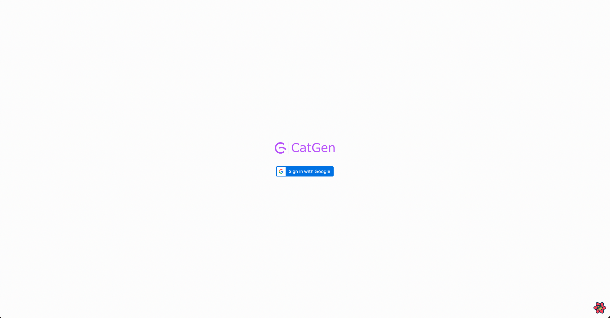
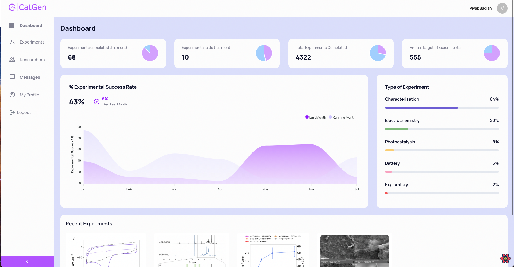
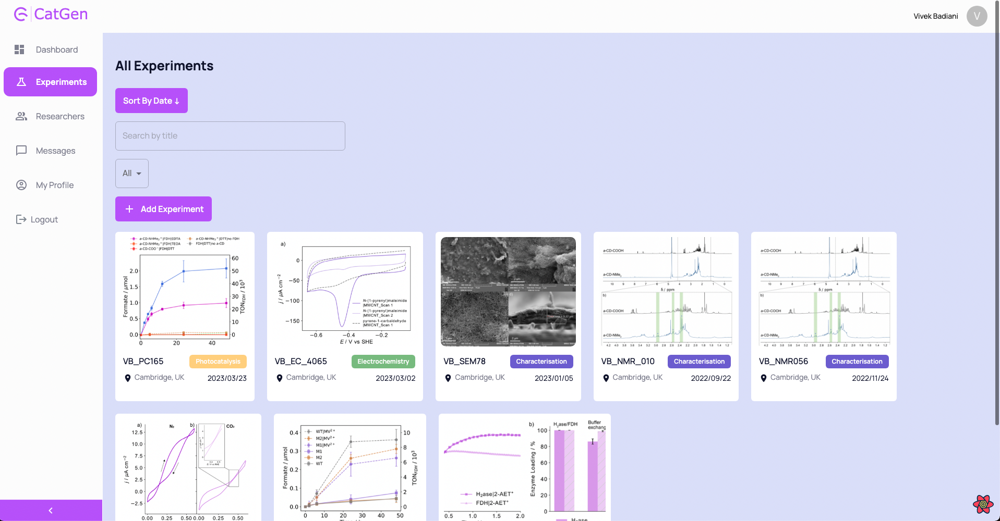
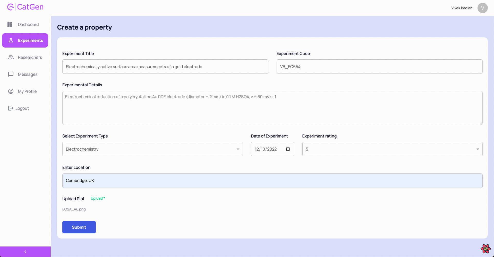
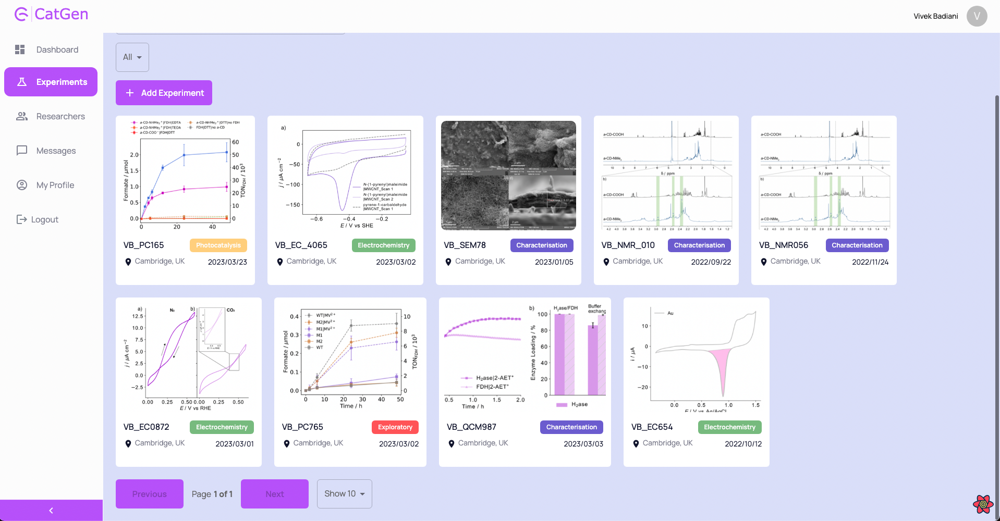
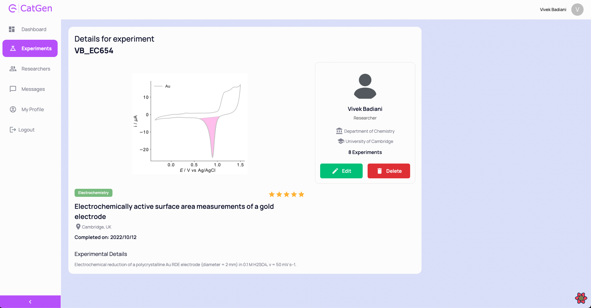
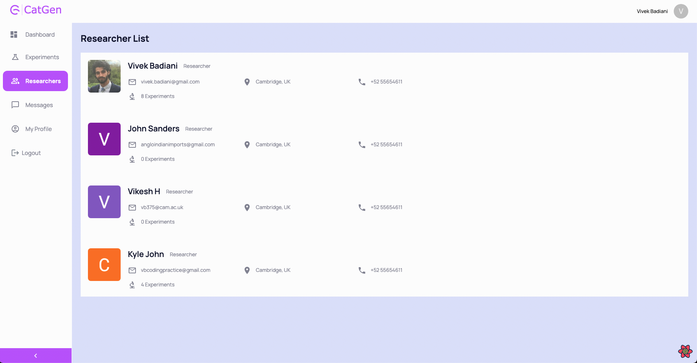
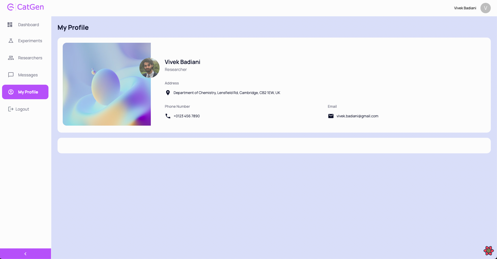

# CatGen - Laboratory Data Management System !(https://catgen-dashboard.netlify.app/)

## MongoDB | Express | Node.js | React.js | refine | MaterialUI

### The Problem

Life in an experimental laboratory means generating hundreds if not thousands of experimental datasets monthly.
Along the way, the data is typically stored, visualised and discussed amongst lab members in order to facilitate planning of next steps, or to include the data in the written journal article.
However, data storing and sharing amongst coworkers is not guaranteed to be a quick and efficient task.
Most commonly, data is shared via slack or email, and there is no online pinboard to manage and share the data across lab teams.

### The Solution

CatGen is an online laboratory data management system. Here are some features:

- Authentication is handled with GoogleAuth to provide rapid user registration and individual user databases.
  
- Upon logging in, a dashboard is presented to the user to keep track of the number of experiments conducted, and their percieved success rates.
- Experiments are categorised by their type and their progress ranked.
  
  
- In the experiment page, the user can upload an experiment, with data including the experiment title, experiment code, a description of the methods, an experiment type, the date and rating of the experiment, as well as the location. Finally, the user will be prompted to upload an image of their experimental plot/data.
  
- Once submitted, the user is redirected to their experiments page, where all uploaded experiments can be found.
- These can be filtered by title, experiment type or sorted by date.
  
- Clicking on an experiment card will open the experimental details page, where the rating, experiment category, and details can be found.
- Here, the experiment can be edited or deleted by the user.
  
- Under the researchers page, a list of all active users can be found.
  
- When the user clicks on their own profile, their details are shown, as well as all experiments they have uploaded, while clicking on other researchers will open their details.
